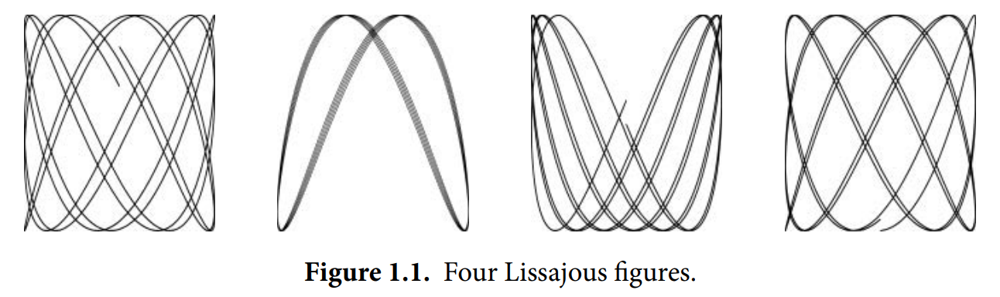

### 1.4 动态GIF图像

接下来的程序将演示Go标准库中`image`包的基本用法，我们将通过它生成一系列位图图像，并将其编码为GIF动画。这些图像被称为**利萨茹图形（Lissajous figures）**，曾是20世纪60年代科幻电影中的经典视觉效果。

利萨茹图形是一种由二维谐波振荡产生的参数曲线，例如将两个正弦波分别输入示波器的x轴和y轴时所形成的图案。图1.1展示了一些示例。



### 代码解析  
这段代码引入了若干新语法结构，包括**常量声明**、**结构体类型**和**复合字面量**。与本书大多数示例不同，本例还涉及浮点运算。这里我们仅简要讨论这些概念（详细内容将在后续章节展开），因为当前的首要目标是让你直观感受：  
1. Go语言的代码风格  
2. 如何用Go及其标准库轻松实现复杂功能  

```go
gopl.io/ch1/lissajous
// Lissajous 生成随机利萨茹图形的GIF动画
package main

import (
	"image"
	"image/color"
	"image/gif"
	"io"
	"math"
	"math/rand"
	"os"
)

// 调色板（白→黑渐变）
var palette = []color.Color{color.White, color.Black} 

const (
	whiteIndex = 0 // 调色板首色（白）
	blackIndex = 1 // 调色板次色（黑）
)

func main() {
	lissajous(os.Stdout) // 输出到标准输出
}

func lissajous(out io.Writer) {
	const (
		cycles  = 5     // x轴振荡器完整转数
		res     = 0.001 // 角分辨率
		size    = 100   // 画布尺寸[-size..+size]
		nframes = 64    // 动画帧数
		delay   = 8     // 帧间延迟（10ms单位）
	)

	freq := rand.Float64() * 3.0 // y轴振荡器相对频率
	anim := gif.GIF{LoopCount: nframes} // GIF动画结构体
	phase := 0.0 // 相位差

	// 生成每帧图像
	for i := 0; i < nframes; i++ {
		rect := image.Rect(0, 0, 2*size+1, 2*size+1) // 画布矩形区
		img := image.NewPaletted(rect, palette)       // 创建调色板图像

		// 计算当前帧像素点
		for t := 0.0; t < cycles*2*math.Pi; t += res {
			x := math.Sin(t)
			y := math.Sin(t*freq + phase)
			img.SetColorIndex(
				size+int(x*size+0.5), 
				size+int(y*size+0.5),
				blackIndex)
		}

		phase += 0.1 // 更新相位
		anim.Delay = append(anim.Delay, delay) // 添加帧延迟
		anim.Image = append(anim.Image, img)   // 添加帧图像
	}
	gif.EncodeAll(out, &anim) // 编码为GIF（忽略错误）
}
```

#### 关键实现细节
1. **调色板机制**：通过`palette`切片实现黑白两色切换  
2. **动画参数**：  
   - `cycles`控制曲线闭合程度  
   - `res`决定曲线平滑度（值越小越精细）  
3. **随机性**：`freq`的随机值使每次运行生成不同图案  
4. **相位动画**：通过`phase`的累加实现图形旋转效果  

> 注意：实际运行时会输出二进制GIF数据，建议将输出重定向到`.gif`文件查看效果


在导入路径包含多级目录的包时（如`image/color`），我们使用最后一级目录名作为包引用名。因此`color.White`属于`image/color`包，而`gif.GIF`属于`image/gif`包。

常量声明（§3.6）为编译时确定的固定值命名，例如控制循环次数、帧数和延迟时间的数值参数。与变量声明类似，常量声明可以出现在包级别（整个包可见）或函数内部（仅函数内可见）。常量值必须是数字、字符串或布尔值。

表达式`[]color.Color{...}`和`gif.GIF{...}`是复合字面量（§4.2，§4.4.1），这种紧凑语法用于根据元素值序列初始化Go的复合类型。前者创建切片，后者创建结构体。

`gif.GIF`是结构体类型（§4.4）。结构体是将不同类型字段组合成的单一对象。变量`anim`是`gif.GIF`类型的结构体，其字面量初始化时将`LoopCount`字段设为`nframes`，其他字段则采用类型零值。通过点号可访问结构体字段，如最后两行代码显式更新了`anim`的`Delay`和`Image`字段。

`lissajous`函数包含两层嵌套循环：
1. 外层循环迭代64次，每轮生成动画的一帧：
   - 创建201×201像素的双色（白/黑）图像
   - 所有像素初始化为调色板零值（白色）
   - 每轮通过将部分像素设为黑色生成新图像
   - 使用内置`append`函数将帧图像和80ms延迟加入`anim`
   - 最终将帧序列编码为GIF写入输出流`out`（`io.Writer`类型支持多种输出目标）

2. 内层循环运行两个振荡器：
   - x振荡器使用标准正弦函数
   - y振荡器也是正弦波，但其特性为：
     * 频率是x振荡器的0-3倍随机值
     * 初始相位差为0，每帧增加0.1
   - 循环持续到x振荡器完成5个完整周期
   - 每步调用`SetColorIndex`将(x,y)对应像素设为调色板索引1（黑色）

`main`函数调用`lissajous`函数并将其输出指向标准输出，因此执行以下命令会生成包含图1.1所示帧的GIF动画：
```bash
$ go build gopl.io/ch1/lissajous
$ ./lissajous >out.gif
```

**练习1.5**：修改利萨茹程序的调色板，改用黑色背景配绿色线条以增强复古效果。要创建Web颜色`#RRGGBB`，需使用`color.RGBA{0xRR, 0xGG, 0xBB, 0xff}`，其中每对十六进制数字分别表示红、绿、蓝通道的强度值。

**练习1.6**：改造利萨茹程序实现彩色输出——先在调色板中添加更多颜色值，然后通过修改`SetColorIndex`的第三个参数以有趣的方式切换颜色。

