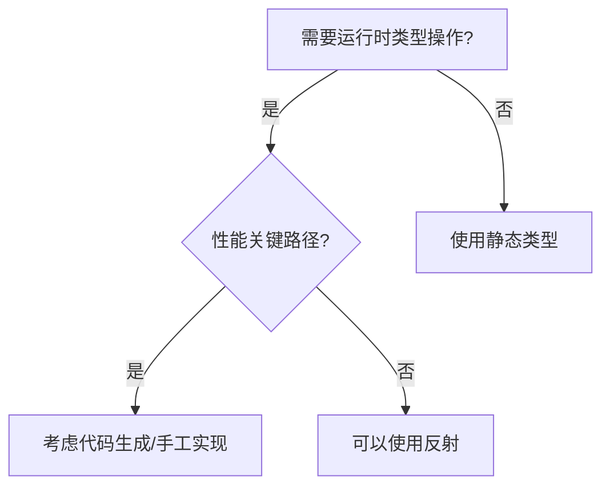

## 12.9 反射使用的注意事项

尽管反射API功能强大，但需要谨慎使用，主要有以下三个原因：

### 1. 代码脆弱性
反射代码容易在运行时出错而非编译时捕获错误，例如：

```go
// 当尝试将字符串设置到int类型变量时
func readList(lex *lexer, v reflect.Value) {
    // 如果错误地将字符串读入int字段
    v.SetString("hello") // 运行时panic
}
```


最佳实践：
- 将反射逻辑封装在包内部

- 在API层使用具体类型而非reflect.Value

- 执行动态类型检查（如标准库fmt.Printf的做法）：

  ```go 
  fmt.Printf("%d %s\n", "hello", 42) 
  // 输出：%!d(string=hello) %!s(int=42)
  ```

  

### 2. 可读性问题
反射代码会带来：
- 失去静态类型检查的保障
- 类型信息不直观
- 重构和分析工具难以处理

解决方案：

```go
// 必须详细记录参数要求
// Process 处理特定类型结构体：
// - 输入必须为结构体指针
// - 必须包含Name string字段
// - 必须实现Serializable接口
func Process(obj interface{}) error {
    // ...
}
```

### 3. 性能损耗
反射操作比直接代码慢1-2个数量级：

| 操作类型     | 执行时间(纳秒/op) |
| ------------ | ----------------- |
| 直接方法调用 | 5-10              |
| 反射方法调用 | 50-200            |

适用场景建议：
- ✅ 适合测试代码（小数据量）
- ✅ 适合初始化/配置阶段
- ❌ 避免在关键路径使用
- ❌ 避免高频循环中使用

### 反射的替代方案
当需要考虑性能时，可以：
1. 使用代码生成（如stringer工具）

2. 维护类型特定的实现

3. 采用接口+类型断言：

  ```go 
  type Processor interface {
      Process() error
  }
  
  func Handle(p Processor) {
      // 比反射更高效的类型安全方案
      if special, ok := p.(*SpecialType); ok {
          special.OptimizedProcess()
      } else {
          p.Process()
      }
  }
  ```

  

### 决策流程图



反射是强大的工具，但应该：限制作用范围、添加保护检查、做好文档记录，并避免在性能敏感区域使用。