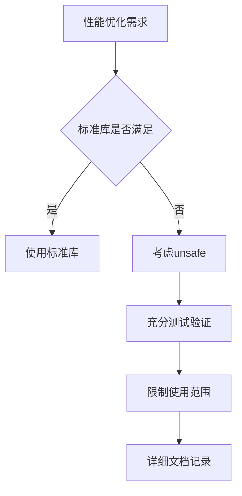

## 13.5 关于unsafe包的进一步警告

### 1. unsafe包的风险

与反射接口相比，unsafe包带来的风险更大：
- 突破Go语言的安全边界
- 依赖底层内存布局
- 丧失平台可移植性
- 引入未定义行为

### 2. 典型风险场景

| 风险类型 | 示例 | 后果 |
|---------|------|------|
| 内存安全 | *(*int)(unsafe.Pointer(uintptr(0x1234))) | 程序崩溃 |
| 类型安全 | *(*float64)(unsafe.Pointer(&intVar)) | 数据损坏 |
| 平台依赖 | unsafe.Sizeof结果因平台而异 | 移植困难 |
| 并发问题 | 非原子指针操作 | 数据竞争 |

### 3. 使用建议

遵循以下原则：
1. 最后手段：
- 仅在标准库无法满足需求时使用
- 必须经过充分验证

2. 最小范围：

  ```go
  func SafeAccess(p unsafe.Pointer) int {
      // 将unsafe操作限制在最小范围
      return *(*int)(p)
  }
  ```

3. 文档记录：

  ```go
  // 使用unsafe进行高性能数组访问
  // 警告：调用者必须确保指针有效且对齐
  func UnsafeArrayAccess(arr []int, index int) int {
      return *(*int)(unsafe.Pointer(uintptr(unsafe.Pointer(&arr[0])) + uintptr(index)*unsafe.Sizeof(arr[0])))
  }
  ```

  性能验证：
- 通过基准测试证明必要性
- 比较安全实现的性能差距

### 4. 替代方案

| 需求 | 安全替代方案 |
|------|--------------|
| 高性能数组 | sync.Pool+预分配 |
| 零拷贝转换 | encoding/binary |
| 内存布局 | reflect.SliceHeader |
| 系统调用 | syscall包 |

### 5. 最佳实践



### 6. 总结建议

1. 优先选择安全方案
2. 将unsafe使用隔离到最小范围
3. 通过测试确保正确性
4. 详细记录使用前提和限制
5. 定期审查和重构

正如Knuth所说："过早优化是万恶之源"。大多数Go程序完全不需要使用unsafe。只有在经过充分验证确实需要时，才应该谨慎使用，并且要将其影响限制在最小范围内。

现在，请将unsafe和reflect的知识暂时放在一边。先编写一些实质性的Go程序，只有在确实需要时才回到这些高级主题。祝您编程愉快，希望您能像我们一样享受Go语言带来的乐趣！